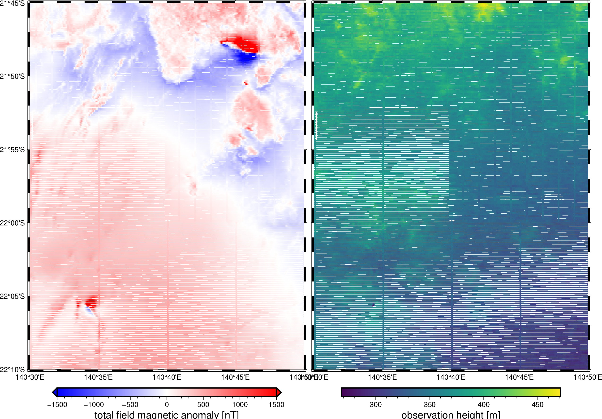

# Osborne Mine, Australia - Airborne total-field magnetic anomaly

This is a section of a survey acquired in 1990 by the Queensland Government,
Australia. The data are good quality with approximately 80 m terrain clearance
and 200 m line spacing. The anomalies are very visible and present interesting
processing and modelling challenges, as well as plenty of literature about
their geology.

| | Summary |
|--:|:--|
| File | `osborne-magnetic.csv.xz` |
| Size | 2.2 Mb |
| Version | [v1](https://github.com/fatiando-data/osborne-magnetic/releases/latest) |
| DOI | https://doi.org/10.5281/zenodo.5882209 |
| License | [CC-BY](https://creativecommons.org/licenses/by/4.0/) |
| MD5 | `md5:a9e680c9b746065a7aea6dc82e198af5` |
| SHA256 | `sha256:243b1f1ed784c8b175db41c546a6d77486fa5e8901def766fef43c04d18ee26a` |
| Source | Geophysical Acquisition & Processing Section 2019. MIM Data from Mt Isa Inlier, QLD (P1029), magnetic line data, AWAGS levelled. Geoscience Australia, Canberra. http://pid.geoscience.gov.au/dataset/ga/142419 |
| Original license | [CC-BY](http://pid.geoscience.gov.au/dataset/ga/142419) |
| Processing code | [`prepare.ipynb`](https://nbviewer.org/github/fatiando-data/osborne-magnetic/blob/main/prepare.ipynb) |

## Changes made

> These are the changes made to the original dataset.

* Change the horizontal datum from GDA94 to WGS84.
* Convert terrain clearance to flight height using an SRTM grid.
* Keep only the coordinates, AWAGS leveled magnetic anomaly, and flight line
  ID.
* Cut to a smaller region containing only the 2 anomalies of interest.

## Useful references

For prior interpretations and geological context:

* [Austin, et al. (2013)](https://doi.org/10.1190/INT-2013-0005.1)
* [Gazley et al. (2016)](https://publications.csiro.au/rpr/download?pid=csiro:EP165511&dsid=DS2)
* [Rezaie (2021)](https://doi.org/10.1007/s00024-021-02747-6)
* [Elllis et al. (2019)](https://doi.org/10.1071/ASEG2012ab117)
* [Perring et al. (2000)](https://doi.org/10.2113/gsecongeo.95.5.1067)

## About this repository

This is a place to format and prepare the original dataset for use in our
tutorials and documentation.

We include the source code that prepares the datasets for redistribution by
filtering, standardizing, converting coordinates, compressing, etc.
The goal is to make loading the data as easy as possible (e.g., a single call
to `pandas.read_csv` or `xarray.load_dataset`).
Whenever possible, the code also downloads the original data (otherwise the
original data are included in this repository).

> 💡 **Tip:** The easiest way to download this dataset is using
> [Pooch](https://www.fatiando.org/pooch), particularly to download straight
> from the DOI of a release.

## Contributing

See our [Contributing Guidelines][contrib] for information on proposing new
datasets and making changes to this repository.

## License

All Python source code is made available under the BSD 3-clause license. You
can freely use and modify the code, without warranty, so long as you provide
attribution to the authors.

Unless otherwise specified, all data files and figures created by the code are
available under the Creative Commons Attribution 4.0 License (CC-BY).

See [`LICENSE.txt`](LICENSE.txt) for the full text of each license.

The license for the original data is specified in this `README.md` file.

[contrib]: https://github.com/fatiando-data/.github/blob/main/CONTRIBUTING.md
